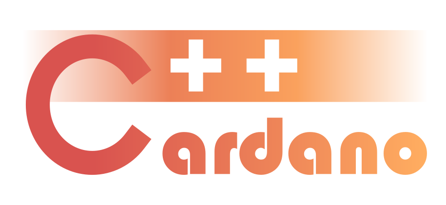

</img>

# Cardano++

A blazingly fast library of Cardano blockchain tools written in modern C++.

## Basic Usage

The Cardano++ library is designed to be a simple plugin for C++ applications to include Cardano blockchain functionality. In your C++ code simply add `#include <cardano>` and then use library objects and methods under the `cardano` namespace. Then link against libcardano during build. A CMake file for including the Cardano++ library in your own C++ projects will be make availible soon.

## Building from Source

The Cardano++ library currently relies on functionality provided in submodules. Prior to building, you must clone the repository including the submodules.

    git clone --recurse-submodules -j8 https://gitlab.com/viper-staking/cardano-plus-plus.git

A CMake build file is included which simplifies the compilation process.

    cd cardano-plus-plus
    mkdir build && cd build \
    cmake -DCMAKE_BUILD_TYPE=Release ..
    make -j 8
    make test
    make install

A Docker build option is also provided.

    docker build -t cardano-plus-plus:latest .

## Features

### Encodings

Supports encoding and decoding [Bech32](https://github.com/bitcoin/bips/blob/master/bip-0173.mediawiki) (Shelley-era) and [Base58](https://tools.ietf.org/id/draft-msporny-base58-01.html) (Byron-era) Cardano addresses to and from raw Base16 (hex) format. [CIP19](https://cips.cardano.org/cips/cip19/) provides a detailed explanation of Cardano encodings.

### Address

### Cardano Crypto Interface
