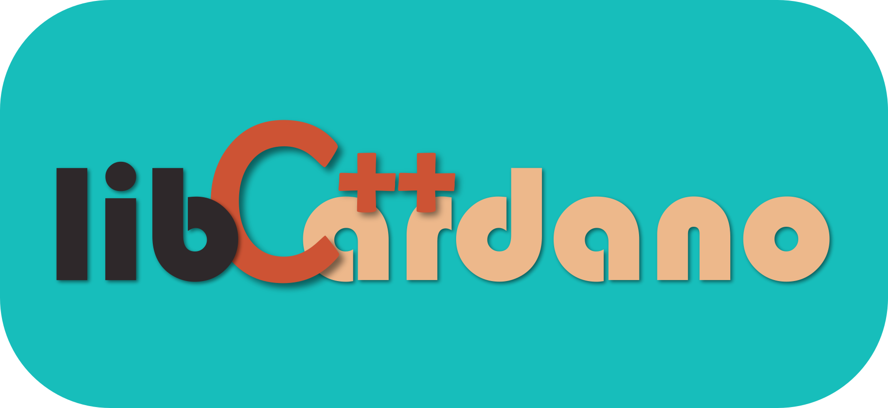

</img>

# libcardano

A high-performance library of Cardano blockchain tools written in modern C++.

## Basic Usage

Libcardano is designed to be a simple plugin for C++ applications to include Cardano blockchain functionality. In your C++ code simply add `#include <cardano/cardano.hpp>` and then use library objects and methods under the `cardano` namespace. Finally, link against libcardano during build. If built and installed properly using the provided CMake configuration, libcardano may be included in your own CMake projects via `fing_package(Cardano)`.

## Building from Source

The libcardano library currently relies on functionality provided in submodules. Prior to building, you must clone the repository including the submodules.

    git clone --recurse-submodules -j8 https://gitlab.com/viper-staking/libcardano.git

A CMake build file is included which simplifies the compilation, test, and install process.

    cd libcardano
    mkdir build && cd build \
    cmake -DCMAKE_BUILD_TYPE=Release ..
    make -j 8
    make test
    make install

A Docker build option is also provided.

    docker build -t libcardano:latest .

### External Dependencies

Libcardano links with the following external dependencies. 

* [Botan-2](https://botan.randombit.net/)
* [libcbor v0.9.0](https://github.com/PJK/libcbor)

The provided Docker file demonstrates how to build and install the required dependencies and Cmake find scripts are also provided.

## Features

### Encodings

Supports encoding and decoding [Bech32](https://github.com/bitcoin/bips/blob/master/bip-0173.mediawiki) (Shelley-era) and [Base58](https://tools.ietf.org/id/draft-msporny-base58-01.html) (Byron-era) Cardano addresses to and from raw Base16 (hex) format. [CIP19](https://cips.cardano.org/cips/cip19/) provides a detailed explanation of Cardano encodings.

### Address

### Cardano Crypto Interface
